# C4 Architecture - Swiss Energy Scenarios Decipher System

## Component Diagram (C4 Level 3)

```mermaid
graph TB
    subgraph "Swiss Energy Scenarios Decipher System"
        
        subgraph "Presentation Layer"
            WEB[Web Interface<br/>📱 Streamlit App<br/>Multilingual UI]
            CLI[CLI Interface<br/>⌨️ Command Line<br/>Developer Tools]
        end
        
        subgraph "Application Layer"
            ORCH[Orchestrator Agent<br/>🎯 Central Coordinator<br/>Query Routing & Synthesis]
            
            subgraph "Specialist Agents"
                DATA[Data Interpreter<br/>📊 Statistics & Trends<br/>CSV Analysis]
                SCEN[Scenario Analyst<br/>🔮 Pathway Comparison<br/>ZERO vs WWB]
                DOC[Document Intelligence<br/>📄 PDF Processing<br/>Report Extraction]
                POL[Policy Context<br/>🏛️ Regulations<br/>Implementation]
                LANG[Language Translator<br/>🌍 Multilingual<br/>EN/DE/FR/IT]
            end
        end
        
        subgraph "Data Processing Layer"
            CSV[CSV Processor<br/>📋 Data Analysis<br/>Time Series Processing]
            PDF[PDF Processor<br/>📖 Document Extraction<br/>Content Analysis]
            CAT[Data Catalog<br/>🗂️ File Discovery<br/>Metadata Management]
        end
        
        subgraph "External Services"
            GPT[OpenAI GPT-4<br/>🤖 Language Model<br/>AI Reasoning Engine]
            CHROMA[ChromaDB<br/>🔍 Vector Database<br/>Document Embeddings]
        end
        
        subgraph "Data Sources"
            SYNTH[Synthesis Data<br/>📈 74 CSV Files<br/>2000-2060 Projections]
            TRANS[Transformation Data<br/>⚡ 13 CSV Files<br/>Electricity System]
            REPORTS[Technical Reports<br/>📚 16 PDF Documents<br/>Methodology & Analysis]
        end
        
        subgraph "Configuration"
            CONFIG[Configuration<br/>⚙️ Environment Settings<br/>API Keys & Paths]
        end
        
    end
    
    style WEB fill:#e3f2fd,stroke:#1976d2,stroke-width:2px
    style CLI fill:#e3f2fd,stroke:#1976d2,stroke-width:2px
    
    style ORCH fill:#fff3e0,stroke:#f57c00,stroke-width:3px
    
    style DATA fill:#f3e5f5,stroke:#7b1fa2,stroke-width:2px
    style SCEN fill:#f3e5f5,stroke:#7b1fa2,stroke-width:2px
    style DOC fill:#f3e5f5,stroke:#7b1fa2,stroke-width:2px
    style POL fill:#f3e5f5,stroke:#7b1fa2,stroke-width:2px
    style LANG fill:#f3e5f5,stroke:#7b1fa2,stroke-width:2px
    
    style CSV fill:#e8f5e8,stroke:#388e3c,stroke-width:2px
    style PDF fill:#e8f5e8,stroke:#388e3c,stroke-width:2px
    style CAT fill:#e8f5e8,stroke:#388e3c,stroke-width:2px
    
    style GPT fill:#ffebee,stroke:#d32f2f,stroke-width:2px
    style CHROMA fill:#ffebee,stroke:#d32f2f,stroke-width:2px
    
    style SYNTH fill:#e0f2f1,stroke:#00695c,stroke-width:2px
    style TRANS fill:#e0f2f1,stroke:#00695c,stroke-width:2px
    style REPORTS fill:#e0f2f1,stroke:#00695c,stroke-width:2px
    
    style CONFIG fill:#fce4ec,stroke:#ad1457,stroke-width:2px
```

## Component Responsibilities

### **Presentation Layer**
- **Web Interface**: Streamlit-based multilingual web application
- **CLI Interface**: Command-line tools for developer interaction

### **Application Layer - Core Orchestration**
- **Orchestrator Agent**: Central coordinator managing query routing and response synthesis

### **Application Layer - Specialist Agents**
- **Data Interpreter**: Analyzes CSV data, provides statistics and trends
- **Scenario Analyst**: Compares energy scenarios and pathways
- **Document Intelligence**: Processes PDF reports and extracts insights  
- **Policy Context**: Provides regulatory and implementation context
- **Language Translator**: Handles multilingual query/response translation

### **Data Processing Layer**
- **CSV Processor**: Handles time series data analysis from 87 CSV files
- **PDF Processor**: Extracts and processes content from 16 technical reports
- **Data Catalog**: Manages file discovery and metadata indexing

### **External Services**
- **OpenAI GPT-4**: Primary AI reasoning and language generation engine
- **ChromaDB**: Vector database for document embeddings and similarity search

### **Data Sources**
- **Synthesis Data**: 74 CSV files with energy projections (2000-2060)
- **Transformation Data**: 13 CSV files focused on electricity system
- **Technical Reports**: 16 PDF documents with methodology and analysis

### **Configuration**
- **Configuration**: Environment-based settings, API keys, and file paths

## Technology Stack by Layer

| Layer | Technologies | Purpose |
|-------|-------------|---------|
| **Presentation** | Streamlit, Click CLI | User interfaces |
| **Application** | Python, AsyncIO, OpenAI API | Agent orchestration |
| **Data Processing** | Pandas, NumPy, PyPDF2 | Data analysis |
| **External Services** | OpenAI GPT-4, ChromaDB | AI & vector storage |
| **Data Sources** | CSV, PDF files | Swiss energy datasets |
| **Configuration** | python-dotenv, dataclasses | Environment management |

## Design Principles

### **Separation of Concerns**
Each component has a single, well-defined responsibility

### **Modularity**
Components can be developed, tested, and deployed independently

### **Scalability**
Horizontal scaling through agent-based architecture

### **Multilingual Support**
Built-in language translation across all components

### **User-Centric Design**
Adaptive interfaces based on user personas (Citizens, Journalists, Students, Policymakers)