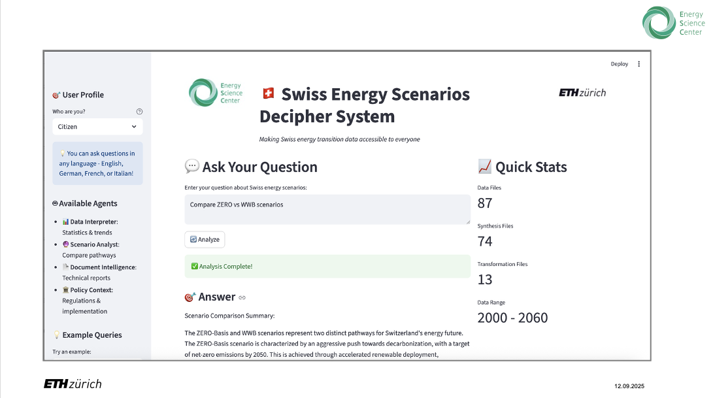

# 🇨🇭 Swiss Energy Scenarios Decipher System

*A collaborative project by ETH Zurich Energy Science Center*



**Making Swiss energy transition data accessible to citizens, journalists, students, and policymakers through intelligent AI agents.**

---

## 🎯 Overview

The Swiss Energy Scenarios Decipher System is a sophisticated multi-agent AI platform developed at **ETH Zurich Energy Science Center** in collaboration with **Hightech Zentrum Aargau AG**, **Energy Data Innovation Hub (EDIH)**, and **Swiss {ai} Weeks** that transforms complex energy scenario data from Switzerland's Energy Perspectives 2050+ into accessible, actionable insights.

### 🧩 The Challenge
- Energy scenarios contain vast, complex datasets difficult for non-experts to interpret
- Citizens, journalists, students, and policymakers need quick, reliable answers about energy transition
- Language barriers limit accessibility across Switzerland's multilingual population
- Trust in energy transition requires transparent, understandable scenario communication

### 🚀 Our Solution
An intelligent multi-agent system featuring:

- **📊 Data Intelligence**: Analyzes 103 data files (87 CSV + 16 PDF reports)
- **🔮 Scenario Comparison**: ZERO-Basis vs WWB pathway analysis
- **🌍 Multilingual Support**: English, German, French, Italian
- **👥 User-Adaptive**: Tailored responses for different user types
- **🤖 AI-Powered**: 6 specialized agents working collaboratively

---

## 🤖 Multi-Agent Architecture

### 🎯 Orchestrator Agent
Central coordinator managing query routing and response synthesis across all specialist agents.

### 📊 Data Interpreter Agent
- Processes 87 CSV files from synthesis and transformation datasets
- Analyzes emissions, energy consumption, electricity generation (2000-2060)
- Provides statistical analysis, trend identification, and cross-scenario comparisons
- Specializes in Swiss energy statistics and projections

### 🔮 Scenario Analyst Agent  
- Compares ZERO-Basis (net-zero) vs WWB (business-as-usual) scenarios
- Explains scenario assumptions, implications, and trade-offs
- Assesses implementation challenges and policy requirements
- Connects scenarios to Switzerland's Net-Zero 2050 commitment

### 📄 Document Intelligence Agent
- Processes 16 PDF technical reports in multiple languages
- Extracts methodology, assumptions, and key findings
- Cross-references information across documents
- Explains complex technical concepts in accessible language

### 🏛️ Policy Context Agent
- Provides Swiss energy policy framework expertise
- Explains regulatory instruments and implementation pathways
- Assesses political feasibility and stakeholder impacts  
- Connects scenarios to federal climate legislation

### 🌍 Language Translator Agent
- Handles automatic language detection and translation
- Supports English, German, French, Italian
- Preserves Swiss energy terminology accuracy
- Enables true multilingual accessibility

---

## 🚀 Getting Started

### Prerequisites
- Python 3.9+
- OpenAI API key
- Virtual environment (recommended)

### Installation

1. **Clone the repository**
   ```bash
   git clone https://github.com/your-repo/swiss-energy-scenarios-decipher
   cd swiss-energy-scenarios-decipher
   ```

2. **Set up virtual environment**
   ```bash
   python -m venv .venv
   source .venv/bin/activate  # On Windows: .venv\Scripts\activate
   ```

3. **Install dependencies**
   ```bash
   pip install -r requirements.txt
   ```

4. **Configure environment**
   ```bash
   cp .env.example .env
   # Edit .env and add your OpenAI API key
   ```

5. **Run the web interface**
   ```bash
   streamlit run streamlit_app.py
   ```

6. **Or run the CLI interface**
   ```bash
   python main.py
   ```

---

## 📊 Data Sources

### Swiss Energy Perspectives 2050+ Dataset
*Source: Swiss Federal Office of Energy (SFOE)*

#### Synthesis Data (74 CSV files)
- **Demographics & Economics**: Population, GDP, employment projections
- **Emissions**: GHG, CO2, CH4, N2O, F-gases by sector and scenario
- **Energy Consumption**: By fuel type, sector, and end-use purpose
- **Electricity System**: Generation, consumption, capacity, prices
- **Technology Deployment**: Renewables, heat pumps, power-to-X
- **Sectoral Analysis**: Transport, buildings, industry, agriculture
- **Economic Analysis**: Investment costs, operation costs, price impacts

#### Transformation Data (13 CSV files)
- Electricity generation by technology and season
- Renewable energy capacity expansion
- Grid integration and storage requirements
- District heating and sector coupling

#### Technical Documentation (16 PDF reports)
- Detailed modeling methodologies
- Scenario assumptions and sensitivity analyses
- Policy recommendations and implementation strategies
- Stakeholder consultation results

---

## 💡 Example Queries

### 📊 Data Analysis Queries
- *"What are Switzerland's CO2 emissions in 2030 under the ZERO scenario?"*
- *"How does renewable electricity generation grow from 2020 to 2050?"*
- *"Compare transport electrification between ZERO and WWB scenarios"*

### 🔮 Scenario Analysis
- *"What's the main difference between ZERO-Basis and WWB scenarios?"*
- *"How do nuclear phase-out assumptions affect electricity supply?"*
- *"What are the economic implications of delayed climate action?"*

### 📄 Document Intelligence
- *"What methodology is used for biomass potential assessment?"*
- *"Explain the assumptions about winter electricity security"*
- *"How are carbon capture technologies modeled?"*

### 🏛️ Policy Context
- *"What policies are needed to achieve net-zero by 2050?"*
- *"How does the revised CO2 Act support energy transition?"*
- *"What are the main implementation barriers for heat pumps?"*

---

## 👥 User-Adaptive Interface

The system tailors responses for different user types:

- **🏠 Citizens**: Simple explanations with local impact focus and practical implications
- **📰 Journalists**: Facts with context, story angles, quotable insights, and data visualization
- **🎓 Students**: Educational content with methodology explanations and learning objectives
- **🏛️ Policymakers**: Comprehensive analysis with implementation roadmaps and cost implications

---

## 🏗️ Technology Stack

### Core Technologies
- **Python 3.9+**: Core programming language
- **OpenAI GPT-4**: Advanced language model for AI reasoning
- **Streamlit**: Interactive web application framework
- **AsyncIO**: Asynchronous operations for performance

### Data & Analytics
- **Pandas & NumPy**: Data manipulation and numerical computing
- **Matplotlib, Seaborn, Plotly**: Data visualization and charting
- **PyPDF2**: PDF document processing

### AI & Machine Learning
- **LangChain**: LLM application framework
- **ChromaDB**: Vector database for document embeddings
- **Sentence Transformers**: Text embedding generation

---

## 🏛️ About ETH Zurich Energy Science Center

This project is developed at the **ETH Zurich Energy Science Center**, Switzerland's leading institution for energy research and innovation. The Energy Science Center brings together interdisciplinary expertise to address the complex challenges of the energy transition.

### Mission
To advance scientific understanding and technological solutions for a sustainable energy future through:
- Cutting-edge research in energy systems and technologies
- Interdisciplinary collaboration across engineering, natural sciences, and social sciences
- Knowledge transfer to industry, policy, and society
- Education of future energy leaders

### Contact
- **Institution**: ETH Zurich Energy Science Center
- **Website**: [www.esc.ethz.ch](https://www.esc.ethz.ch)
- **Location**: Zurich, Switzerland

---

## 📁 Project Structure

```
swiss-energy-scenarios-decipher/
├── src/
│   ├── agents/                    # AI agent implementations
│   │   ├── base_agent.py         # Base agent framework
│   │   ├── orchestrator_agent.py # Central coordinator
│   │   ├── data_interpreter_agent.py
│   │   ├── scenario_analyst_agent.py
│   │   ├── document_intelligence_agent.py
│   │   ├── policy_context_agent.py
│   │   └── language_translator_agent.py
│   ├── data_processors/           # Data processing utilities
│   │   ├── csv_processor.py      # CSV data analysis
│   │   └── pdf_processor.py      # PDF document processing
│   ├── interfaces/               # User interfaces
│   │   ├── cli_interface.py      # Command-line interface
│   │   └── cli_interface_de.py   # German CLI interface
│   └── utils/                    # Configuration and utilities
│       └── config.py             # System configuration
├── data/                         # Energy scenario datasets
│   ├── extracted/
│   │   ├── synthesis/           # 74 CSV files
│   │   └── transformation/      # 13 CSV files
│   └── reports/                 # 16 PDF documents
├── images/                       # Application screenshots and logos
│   ├── App-Shot.png            # Main application screenshot
│   ├── ETH-Logo.jpg            # ETH Zurich logo
│   └── enregy-center.jpg       # Energy Science Center logo
├── docs/                        # Documentation
├── streamlit_app.py             # Main web interface
├── main.py                      # CLI entry point
├── requirements.txt             # Python dependencies
└── README.md                    # This file
```

---

## ⚙️ Configuration

Create a `.env` file with the following variables:

```env
OPENAI_API_KEY=your_openai_api_key_here
MODEL_NAME=gpt-4
TEMPERATURE=0.3
MAX_TOKENS=2000
```

### Configuration Options
- `OPENAI_API_KEY`: Your OpenAI API key (required)
- `MODEL_NAME`: OpenAI model to use (default: gpt-4)
- `TEMPERATURE`: Response creativity level (0.0-1.0, default: 0.3)
- `MAX_TOKENS`: Maximum response length (default: 2000)

---

## 🧪 Testing

Run system configuration test:
```bash
python test_system.py
```

Verify data loading:
```bash
python quick_test.py
```

---

## 🤝 Contributing

We welcome contributions from the research community! Please:

1. Fork the repository
2. Create a feature branch (`git checkout -b feature/amazing-feature`)
3. Commit changes (`git commit -m 'Add amazing feature'`)
4. Push to branch (`git push origin feature/amazing-feature`)
5. Open a Pull Request

### Development Guidelines
- Follow Python PEP 8 style guidelines
- Add type hints for new functions
- Include docstrings for all public methods
- Test new features with provided test scripts

---

## 🙏 Acknowledgments

### Data & Research Partners
- **Swiss Federal Office of Energy (SFOE)** for Energy Perspectives 2050+ dataset
- **Swiss energy research community** for domain expertise and validation

### Technology Partners
- **OpenAI** for advanced language model capabilities
- **Open source community** for the excellent Python ecosystem

### Academic & Industry Partners
- **ETH Zurich Energy Science Center**
- **Hightech Zentrum Aargau AG**
- **Energy Data Innovation Hub (EDIH)**
- **Swiss {ai} Weeks**

---

## 📞 Support & Contact

### Technical Support
- **🐛 Issues**: [GitHub Issues](https://github.com/your-repo/swiss-energy-scenarios-decipher/issues)
- **📚 Documentation**: Available in `/docs` folder

### Research Inquiries
- **ETH Zurich Energy Science Center**: [www.esc.ethz.ch](https://www.esc.ethz.ch)
- **Academic Collaboration**: Contact via ETH Zurich official channels

---

<div align="center">

**🇨🇭 Making Swiss energy transition data accessible to everyone 🇨🇭**

*A project by ETH Zurich Energy Science Center*

[](https://ethz.ch)
[](https://www.esc.ethz.ch)
[](https://python.org)
[](https://openai.com)

</div>