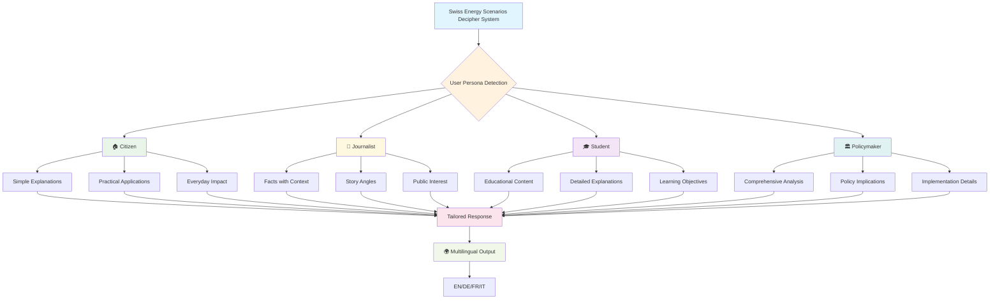
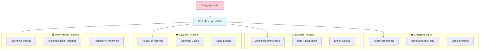

# Swiss Energy Scenarios Decipher System - User Personas

## User Persona Flow Diagram

## Persona-Focused Diagram

## User Personas Overview

### 👥 **User Types**
The system adapts responses based on 4 user types:

1. **🏠 Citizen** 
   - **Response Style:** Simple, practical explanations
   - **Focus:** Everyday impact, energy bills, home efficiency
   - **Example:** "How will the energy transition affect my heating costs?"

2. **📰 Journalist** 
   - **Response Style:** Facts with context and story angles
   - **Focus:** Breaking news, data visualization, expert perspectives
   - **Example:** "What's the latest data on renewable energy adoption in Switzerland?"

3. **🎓 Student** 
   - **Response Style:** Educational content with detailed explanations
   - **Focus:** Research methods, technical details, case studies
   - **Example:** "Explain the methodology used in Swiss energy scenario modeling"

4. **🏛️ Policymaker** 
   - **Response Style:** Comprehensive analysis with implications
   - **Focus:** Economic impact, implementation roadmaps, regulatory frameworks
   - **Example:** "What are the policy implications of the ZERO scenario by 2030?"

### 🌍 **Multilingual Support**
All personas receive responses in their preferred language:
- **🇬🇧 English** - International communication
- **🇩🇪 Deutsch** - German-speaking Switzerland
- **🇫🇷 Français** - French-speaking Switzerland  
- **🇮🇹 Italiano** - Italian-speaking Switzerland

The system automatically detects query language and provides responses in the user's selected interface language, ensuring accessibility across all Swiss linguistic regions.